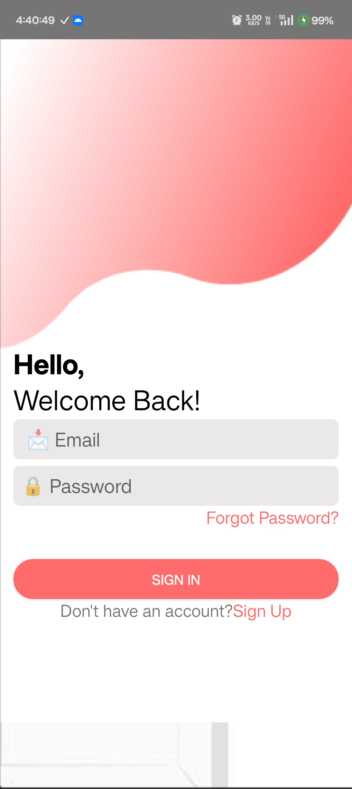
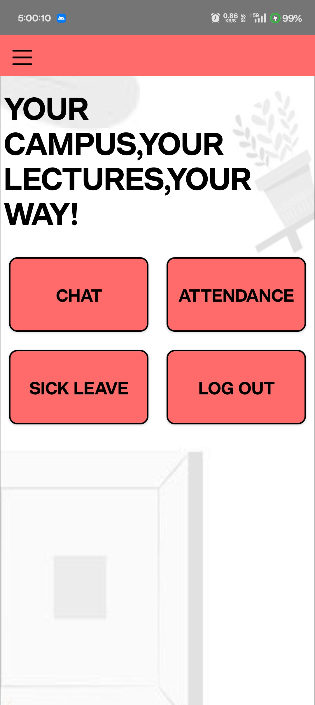
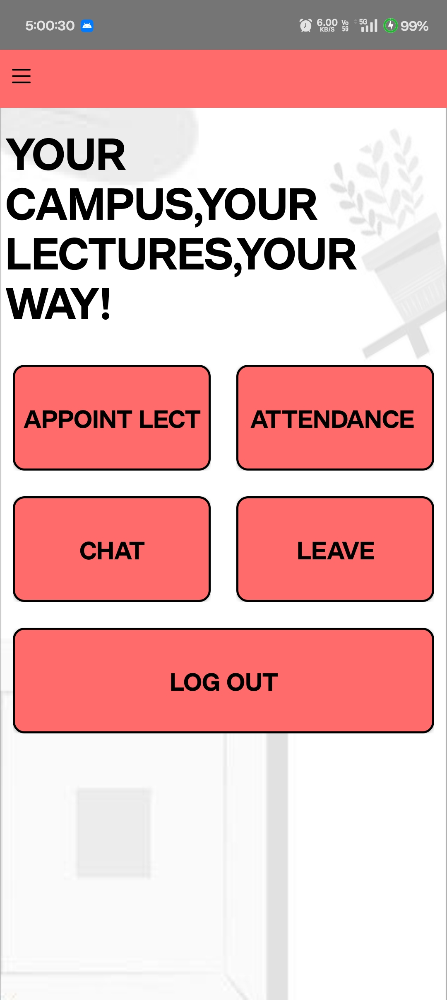

# GEOMENT - Geofence-Based Attendance App

---

## Project Overview
*GEOMENT* is an Android application designed to simplify attendance management in schools and colleges using geofencing technology. The app ensures that students can only mark attendance when physically present within a specified location, eliminating manual errors and fraudulent entries. Teachers can easily schedule lectures, track attendance, approve/reject sick leaves, and export attendance records as PDFs.

---

## Features

### Student Mode
- Secure registration and login (Name, PRN, Email, Year, Branch)  
- View scheduled lectures specific to branch and year  
- Mark attendance via geofencing (location-based validation)  
- Apply for sick leave with document upload  
- In-app chat with teachers for seamless communication  

### Teacher Mode
- Schedule lectures  
- Track and export attendance records as PDF  
- Approve or reject student sick leave applications  
- View uploaded medical documents  
- Access student chat messages  

---

## Screenshots & Demo

### Screenshots

### Demo GIF / Video
 <!-- Or link MP4 -->
[Watch Full Demo Video](./demo/GEOMENT_demo.mp4)

---

## Tech Stack
- *Android Studio (Java)*  
- *Firebase* (Authentication, Firestore, Cloud Storage)  
- *Cloudinary* for file storage and management  
- *Excel* for attendance export  
- *Geolocation APIs* for latitude & longitude  
- *PDF generation library* for attendance reports  

---
---

## Usage
1. Students register and log in to view lectures and mark attendance.  
2. Teachers schedule lectures and monitor attendance.  
3. Sick leave applications can be submitted and approved/rejected within the app.  
4. Attendance records can be exported as PDFs for official use.  

---

## Project Structure
GEOMENT/ ├── app/        # Android Studio project files
         ├── images/     # Screenshots and banners
         ├── demo/       # Demo video or GIF
         ├── README.md 
         └── ...

---

## Project Benefits
- Eliminates manual errors  
- Prevents fraudulent attendance marking via geofencing  
- Saves time for students and teachers  
- Streamlines the attendance process efficiently  

---

## Future Enhancements
- Push notifications for lecture reminders  
- Analytics dashboard for teachers to track attendance trends  
- Integration with institution ERP or LMS  

---

## Authors
- *Urv Patel* – [GitHub Profile](https://github.com/urva2)  
- *Smit Gandhi* – [GitHub Profile](https://github.com/smitgandhi)  
- *Ankit Jethava* – [GitHub Profile](https://github.com/ankitjethava)
